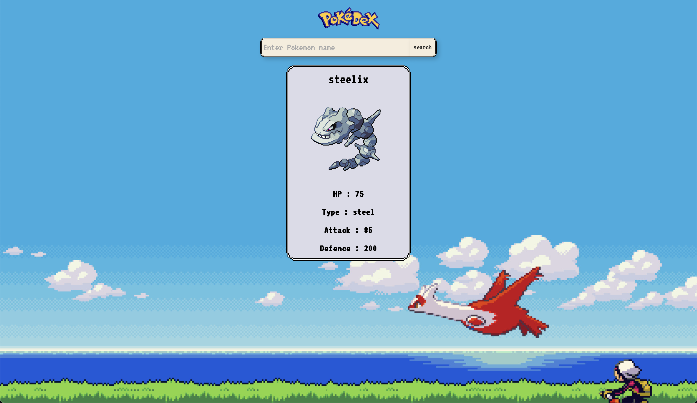

# Pokedex

-   Built using svelte and [pokeapi](https://pokeapi.co)

## Setup

Clone the project

```sh
git clone https://github.com/weasel-0/Pokedex.git
```

Install dependencies


```sh
npm i
```

Start the project and open localhost

```sh
npm run dev
```

<details>
<summary>Preview</summary>



</details>
